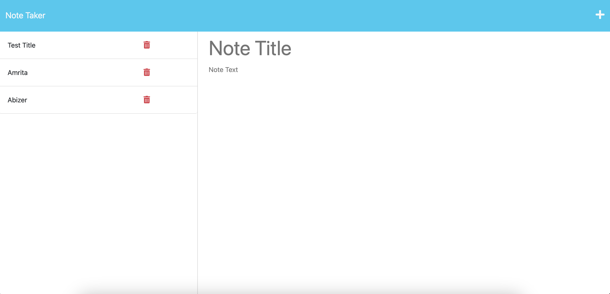
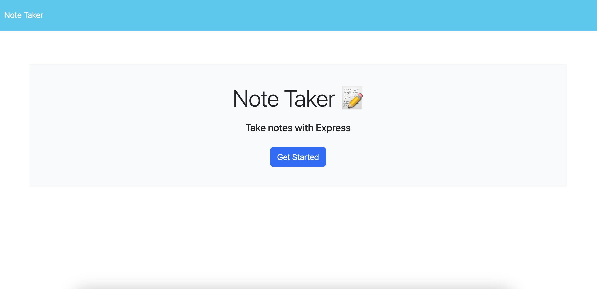

# Needy-Notes


## Description
- This application allows users users write and save notes. Application was built using express.js.

## Table of Contents
- [Installation](#installation)
- [Usage](#usage)
- [Credits](#credits) 
- [License](#license)
- [Tests](#tests)
- [Questions](#questions)
- [Contribute](#contribute)


## Installation
To install this application, please follow the steps below:
Run the following line of code in your terminal to install all the needed packages: 
```
npm i
```

## Usage
Run the following in the comand line to run the applicaiton. This will run the server where you can find the page on localhost:3001.
```
npm start
```





## Credits
None


## Licensing 
The application is covered under mit license.
[mit](https://choosealicense.com/licenses/mit)

## Tests
No testing at this time.

## Questions 
If you have any questions, you can reach me at Amritachatarpal@gmail.com and follow my work at [Amritaraja](https://github.com/Amritaraja/)
